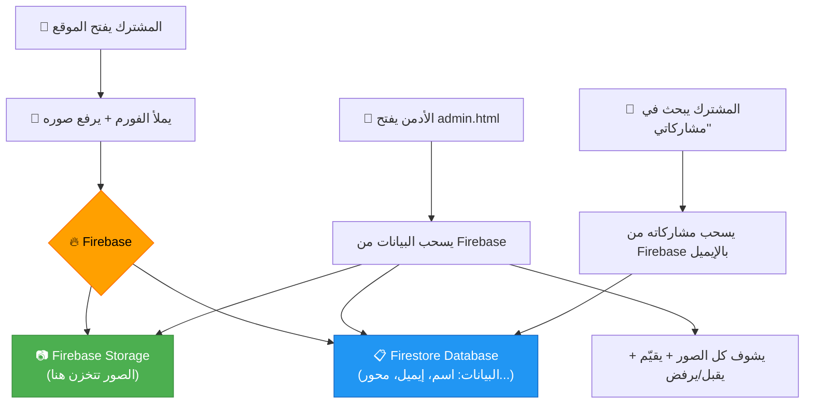
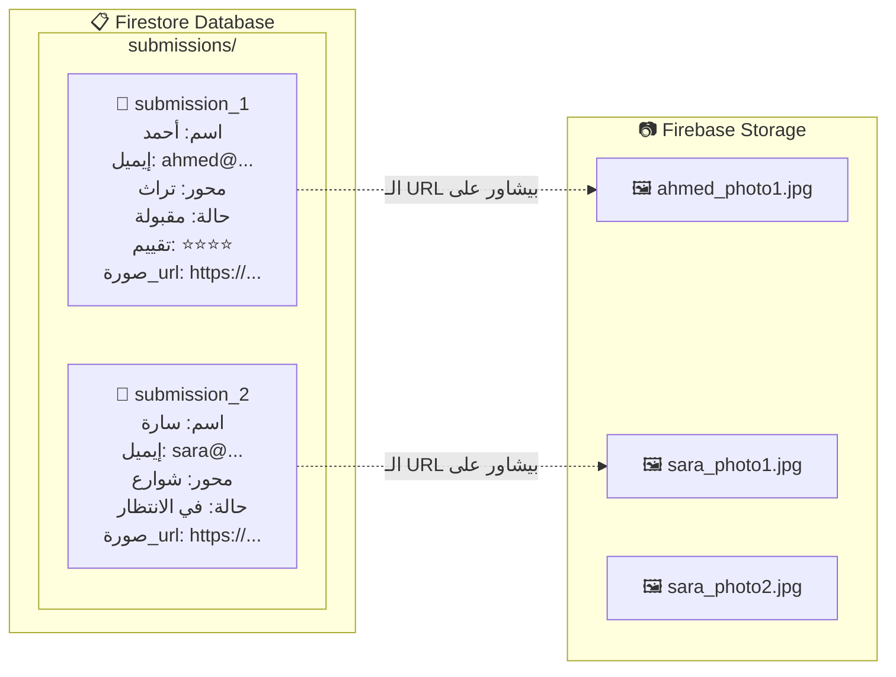

# 🔥 إزاي Firebase هيشتغل مع موقع روح مصريه

## الفكرة ببساطة

Firebase ده زي **مخزن أونلاين مجاني** من Google. بدل ما الصور تتخزن في المتصفح بتاعك وتضيع، بتتخزن على سيرفرات Google وتقدر توصلها من أي مكان.

## 📊 التدفق كله



## 🏗️ Firebase فيه خدمتين هنستخدمهم

### 1. Firebase Storage (لتخزين الصور)
- الصور بتترفع كملفات (JPG/PNG) على سيرفرات Google
- كل صورة بياخد **لينك URL** تقدر تفتحه من أي مكان
- زي ما بترفع صورة على Google Drive بالظبط

### 2. Firestore Database (لتخزين البيانات)
- البيانات النصية (اسم، إيميل، تليفون، محور، حالة، تقييم...)
- بيتخزنوا كـ **documents** في **collections**
- زي ملف Excel أونلاين كده



## 💰 التكلفة

> [!TIP]
> **Firebase مجاني تماماً** في الخطة المجانية (Spark Plan) وده يكفيك جداً لمسابقة تصوير

| الخدمة | الحد المجاني | يعني إيه عملياً |
|--------|-------------|----------------|
| **Storage** | 5 GB | حوالي **1,000 صورة** بجودة عالية |
| **Firestore** | 1 GB + 50,000 قراءة/يوم | **آلاف** المشاركات |
| **Bandwidth** | 1 GB/يوم تحميل | كافي لمئات الزوار يومياً |

## 🛠️ إزاي تعمل الإعداد (5 دقايق)

### الخطوة 1: إنشاء مشروع
1. افتح [Firebase Console](https://console.firebase.google.com/)
2. اضغط **"Add Project"** أو **"إضافة مشروع"**
3. سمّيه `rouh-masrya`
4. اضغط Continue (ممكن تلغي Google Analytics مش محتاجها)

### الخطوة 2: تفعيل Storage
1. من القائمة الجانبية اضغط **"Storage"**
2. اضغط **"Get Started"**
3. اختار **"Start in test mode"** (عشان يشتغل بدون تسجيل دخول)
4. اختار Location أقرب ليك (مثلاً `europe-west1`)

### الخطوة 3: تفعيل Firestore
1. من القائمة الجانبية اضغط **"Firestore Database"**
2. اضغط **"Create Database"**
3. اختار **"Start in test mode"**
4. اختار نفس الـ Location

### الخطوة 4: جيب الـ Config
1. اضغط على ⚙️ (Settings) → **Project Settings**
2. انزل لـ **"Your apps"** → اضغط **Web** (أيقونة `</>`)
3. سجّل اسم `rouh-web`
4. هيظهرلك كود فيه:

```js
const firebaseConfig = {
  apiKey: "AIza.....................",
  authDomain: "rouh-masrya.firebaseapp.com",
  projectId: "rouh-masrya",
  storageBucket: "rouh-masrya.appspot.com",
  messagingSenderId: "123456789",
  appId: "1:123456789:web:abcdef"
};
```

### الخطوة 5: ابعتلي الكود ده ⬆️
وأنا أربطه بالموقع في دقايق!

---

## ❓ عاوز تبدأ؟
لما تعمل الخطوات دي وتبعتلي الـ `firebaseConfig`، أنا هعدل الكود عشان:
- الصور تترفع على Firebase Storage
- البيانات تتخزن في Firestore
- صفحة الأدمن تسحب الداتا من Firebase
- قسم "مشاركاتي" يشتغل أونلاين
